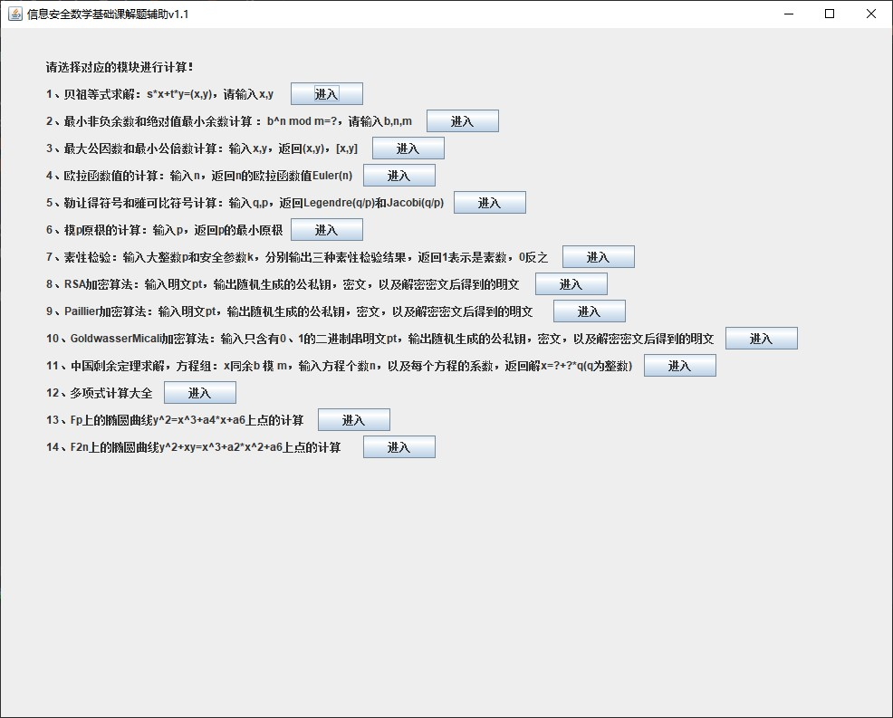
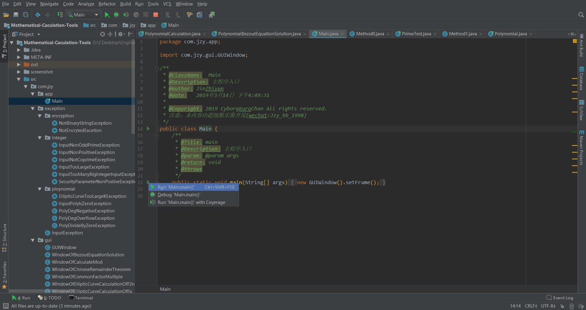
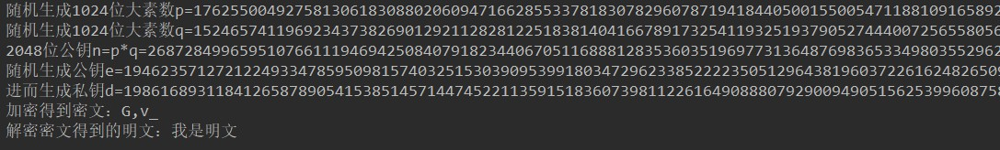
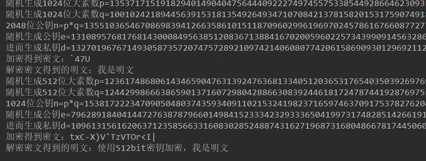

# Mathematical-Calculation-Tools

* *`Mathematical-Calculation-Tools`*是一个数值计算工具，功能包括整数域的运算(e.g 贝祖等式求解、勒让得符号、原根、素性检验....）；多项式的运算（e.g 贝祖等式求解、不可约多项式、本原多项式判断....)；加密算法（e.g. RSA)；椭圆曲线上的计算。
* 面向人群主要是上海交通大学信息安全专业修读《信息安全数学基础》课程的学生；其他网安专业学习数学理论基础的学生；抽象代数、应用数学领域学习的学生。
* 含图形界面
* 提供windows端的exe可执行程序；提供jar包，可作为api引用或在装有jre环境的机器上直接运行 
* 这里酷乐酱用原生java实现，没有使用任何第三方api，算法原理全部参考陈恭亮老师编著的《信息安全数学基础》教材以及wiki，开源以供大家学习。


## 快速上手

### 运行exe

对大部分同学而言，在64位windows操作系统上可直接双击运行*`Mathematical-Caculation-Tools.exe`*



### 使用jar包

在装有jre（>1.5）的机器上直接双击*`Mathematical-Caculation-Tools.jar`*也可以直接得到图形界面

### 使用开发工具建立项目并运行

如果您装有jdk，以及idea、eclipse等开发环境和开发工具，可以导入的我源码（在src中），找到com.jzy.gui.GUIWindow.Main.java文件直接运行。



#### My environment

* *java*

  java version "1.8.0_211"
  Java(TM) SE Runtime Environment (build 1.8.0_211-b12)
  Java HotSpot(TM) 64-Bit Server VM (build 25.211-b12, mixed mode)

* *IDE*

  IntelliJ IDEA 2018.1.7 (Ultimate Edition)
  Build #IU-181.5540.23, built on November 12, 2018
  JRE: 1.8.0_152-release-1136-b43 amd64
  JVM: OpenJDK 64-Bit Server VM by JetBrains s.r.o
  Windows 10 10.0


## Project Struture

```
└─src
    └─com
        └─jzy
            ├─app    //主函数入口
            ├─exception    //异常处理类根目录
            │  ├─encryption    //加密类的异常
            │  ├─integer    //整数域计算方法的异常
            │  └─ploynomial    //多项式域计算方法的异常
            ├─gui     //所有图形界面代码的根目录
            ├─util    //工具包
            └─xxaqsxjc    //所有关键方法根目录
                ├─encyption    //加密类根目录
                │  ├─algorithm     //加密类的实现，这里实现了RSA、GoldwasserMicali、Paillier
                │  ├─executor   //加密类接口
                │  └─factory    //加密类工厂实现
                ├─method0     //《信息安全数学基础》（1）（大二下）中涵盖的大部分运算的代码实现
                └─method1     //《信息安全数学基础》（2）（大三上）中涵盖的大部分运算的代码实现
```


## 如何使用代码？

这里省略对于图形界面的使用教程，正常脑壳的人都能上手。

代码中对您有用的api大部分都涵盖在了*`com.jzy.xxaqsxjc`*包下，所有代码都有详细的注释，这里列举关键方法和部分示例。

### com.jzy.xxaqsxjc.method0 

此包主要是大二下《信息安全数学基础》课学习的知识点实现，您可以直接调用Method0.java中的静态方法，其涵盖了该包下大部分功能的api。使用示例如下：

```java
import com.jzy.xxaqsxjc.method0.Method0;

import java.math.BigInteger;

public class Test {
    public static void main(String[] args) {
        BigInteger x=new BigInteger("100");
        BigInteger y=new BigInteger("120");
        //x，y的最大公因数
        System.out.println(Method0.maxCommonFactorXY(x,y));
        //x，y的贝祖等式求解
        BigInteger []r=Method0.bezoutSolveQrSt(x,y);
        System.out.println("s="+r[0]+", t="+r[1]);
        //费马素性检验
        BigInteger p=new BigInteger("912429886857661");
        System.out.println(Method0.fermat(p));
        //最小原根
        p=new BigInteger("23");
        System.out.println(Method0.minPrimitiveRoot(p));
    }
}
```

* CalculateMod.java：计算大整数模
* CommonFactorMultiple.java：最大公因数和最小公倍数计算
* BezoutEquationSolution.java：贝祖等式系数求解
* EulerFuction.java：欧拉函数值计算
* Legendre.java：勒让得符号计算
* Jacobi.java：雅可比符号计算
* PrimeTest.java：素性检验，集成了三种素性检验和暴力检验
* PrimitiveRoot.java：原根计算
* ChineseRemainderTheorem.java：中国剩余定理求解
* Method0.java：该包下大部分方法的入口

#### com.jzy.xxaqsxjc.method1

此包主要是大三上《信息安全数学基础》课学习的知识点实现，您可以直接调用Method1.java中的静态方法，其涵盖了该包下大部分功能的api。使用示例如下：

```java
import com.jzy.xxaqsxjc.method1.Method1;
import com.jzy.xxaqsxjc.method1.Polynomial;

public class Test {
    public static void main(String[] args) {
        int[] a = {1, 1, 1, 0, 1};
        int[] b = {1, 0, 1, 1, 1, 0, 0, 0, 1};
        Polynomial pa = new Polynomial(a);
        Polynomial pb = new Polynomial(b);
        System.out.println(pa);
        System.out.println(pb);
        //多项式计算
        System.out.println(pa.add(pb));
        System.out.println(pa.multiply(pb));
        System.out.println(pb.divide(pa));
        System.out.println(Polynomial.pow(pb, 10));
        //多项式最大公因式
        System.out.println(Method1.maxCommonFactor(pa,pb));
    }
}
```

* Polynomial.java：多项式计算基础类

* PolynomialBezoutEquationSolution.java：多项式贝祖等式系数求解

* PolynomialCalculation.java：多项式其他一些相关计算

* EllipticCurveCalculationOfFp.java：Fp上的椭圆曲线点的计算

  该方法不能通过Method1的静态方法调用，需要手工创建实例对象，使用实例如下：

  ```java
  import com.jzy.xxaqsxjc.method1.EllipticCurveCalculationOfFp;
  
  import java.math.BigInteger;
  import java.util.ArrayList;
  
  public class Test {
      public static void main(String[] args) {
          //传入椭圆曲线参数，创建实例
          EllipticCurveCalculationOfFp eccfp = new EllipticCurveCalculationOfFp(new BigInteger("100823"), new BigInteger("3"), new BigInteger("7"));
          //点P1
          BigInteger[] p1 = {new BigInteger("5"), new BigInteger("101")};
          //计算P1、2P1、3P1、...kP1
          ArrayList<BigInteger[]> rs = eccfp.kPointSet(p1, 27);
          for (int i = 0; i < rs.size(); i++) {
              System.out.println("x" + (i + 1) + "=" + rs.get(i)[0]);
              System.out.println("y" + (i + 1) + "=" + rs.get(i)[1]);
              System.out.println();
          }
          //计算10P1
          System.out.println(eccfp.kPoint(p1, 10)[0]);
          System.out.println(eccfp.kPoint(p1, 10)[1]);
          //计算当前椭圆曲线的阶
          System.out.println(eccfp.ordFp());
      }
  
  }
  ```

* EllipticCurveCalculationOfF2n.java：F2n上的椭圆曲线点的计算

  使用类比EllipticCurveCalculationOfFp.java

* Method1.java：该包下除椭圆曲线计算所有方法的入口

#### com.jzy.xxaqsxjc.encyption.algorithm

该包下提供三种加密算法，这里处于代码实现的简便，直接对明文逐个字符进行加密，使用实例如下：

* RSAEncryption.java：RSA加密算法

  see more about RSA: *https://en.wikipedia.org/wiki/RSA_(cryptosystem)*

  * 方法一：通过有参构造器传入明文

    ```java
    import com.jzy.xxaqsxjc.encyption.algorithm.RSAEncryption;
    
    public class Test {
        public static void main(String[] args) {
            RSAEncryption rsa1 = new RSAEncryption("我是明文");
    //        System.out.println(rsa1.encrypt());  //加密得到密文
    //        System.out.println(rsa1.decrypt());  //解密得到明文
            //这里通过show()方法直观展示加密情况，也可以使用encrypt()单独输出密文等等
            rsa1.show();
        }
    }
    ```

    

  * 方法二：通过无参构造器创建对象，通过setPlainText方法传入明文

    ```java
    import com.jzy.xxaqsxjc.encyption.algorithm.RSAEncryption;
    
    public class Test {
        public static void main(String[] args) {
            RSAEncryption rsa1 = new RSAEncryption();
            rsa1.setPlainText("我是明文");
            rsa1.show();
        }
    }
    ```

  * 方法三：通过工厂获得加密类实例（单例），再通过setPlainText方法传入明文

    ```java
    import com.jzy.xxaqsxjc.encyption.EncyptionAlgorithm;
    import com.jzy.xxaqsxjc.encyption.algorithm.RSAEncryption;
    import com.jzy.xxaqsxjc.encyption.factory.EncryptionFactory;
    
    public class Test {
        public static void main(String[] args) {
            //传入枚举参数RSA，从工厂获得实例
            RSAEncryption rsa1 = (RSAEncryption) EncryptionFactory.getEncryption(EncyptionAlgorithm.RSA);
            rsa1.setPlainText("我是明文");
            rsa1.show();
        }
    }
    ```

  * 其他：重置密钥

    默认密钥在编译代码时确定，默认位宽1024bit。可以通过resetKeys()静态方法重置（指定位宽）密钥

    ```java
    import com.jzy.xxaqsxjc.encyption.EncyptionAlgorithm;
    import com.jzy.xxaqsxjc.encyption.algorithm.RSAEncryption;
    import com.jzy.xxaqsxjc.encyption.factory.EncryptionFactory;
    
    public class Test {
        public static void main(String[] args) {
            //传入枚举参数RSA，从工厂获得实例
            RSAEncryption rsa1 = (RSAEncryption) EncryptionFactory.getEncryption(EncyptionAlgorithm.RSA);
            rsa1.setPlainText("我是明文");
            rsa1.show();
            //重置密钥位宽512bit
            RSAEncryption.resetKeys(512);
            rsa1.setPlainText("使用512bit密钥加密，我是明文");
            rsa1.show();
        }
    }
    ```

    

* GoldwasserMicaliBinaryEncryption.java：GoldwasserMicali二进制串加密算法

  see more about GoldwasserMicali :*https://en.wikipedia.org/wiki/Goldwasser–Micali_cryptosystem*

  使用类比RSA加密

* PaillierEncryption.java：Paillier加密算法

  see more about Paillier：*https://en.wikipedia.org/wiki/Paillier_cryptosystem*
  
  使用类比RSA加密

